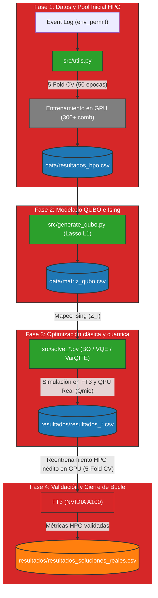

# HPO Cuántico para Redes Deep Learning: Reproducibilidad

Este repositorio contiene el código fuente, datos y scripts desarrollados para el Trabajo de Fin de Grado (TFG) enfocado en la **Optimización de Hiperparámetros (HPO) mediante computación cuántica** para modelos de minería de procesos (EventTransformer) entrenados con el dataset real `env_permit`.

Se modela el problema HPO como una formulación binaria cuadrática (**QUBO**) de 30 variables (30 cúbits), la cual se resuelve mediante resolvedores clásicos (**Optimización Bayesiana**) y resolvedores cuánticos variacionales (**VQE** y **VarQITE**), ejecutados en el Supercomputador FinisTerrae III y el ordenador cuántico superconductor real **Qmio** del CESGA.

---

## Estructura del Proyecto

*   **`src/`**: Directorio raíz del código fuente principal.
    *   `config.py`: Parámetros globales y semillas pseudoaleatorias ($7, 42, 99, 123, 1001$).
    *   `embeddings.py`, `encoders_and_decoders.py`, `output_layers.py`, `training.py`, `evaluation.py`, `utils.py`: Módulos de la arquitectura PyTorch `EventTransformer`.
    *   `sampler_hpo.py`, `train_hpo.py`, `generate_qubo.py`: Samplers HPO y modelado QUBO.
    *   `solve_bayes_opt.py`, `solve_vqe.py`, `solve_qite.py`: Resolvedores clásicos y cuánticos.
    *   `generate_plots.py`: Generación de gráficas consolidadas de rendimiento.
    *   `data_processors/`: Tuberías de preprocesamiento de logs.
*   **`slurm/`**: Trabajos Bash de orquestación Slurm en el clúster del CESGA (envíos por array de HPO, barridos de ruido y envíos a la QPU de Qmio).
*   **`data/`**: Contiene el pool HPO consolidado (`resultados_hpo.csv`), la matriz de acoplamientos (`matriz_qubo.csv`), los JSON de configuración y los registros de eventos particionados.
*   **`resultados/`**: Base de datos de soluciones reales y gráficas del TFG.
*   **`docs/`**: Documentación complementaria y capítulos LaTeX.

---

## Flujo del Pipeline HPO



---

## Guía Rápida de Uso (FT3 CESGA)

### 1. Inicialización del Entorno
Conéctese al clúster y configure el entorno virtual aislado en la partición `/Store`:
```bash
git clone https://github.com/fedellor/TFG_QITE_HPO_Reproducibility.git
cd TFG_QITE_HPO_Reproducibility
chmod +x slurm/setup_env.sh
./slurm/setup_env.sh
```

### 2. Ejecución del Pipeline HPO
1. **Generar Pool Inicial HPO (300 combinaciones):**
   ```bash
   python src/sampler_hpo.py
   sbatch slurm/launch_hpo.sh
   ```
2. **Generar el QUBO (Regresión Lasso L1 LARS):**
   ```bash
   python src/generate_qubo.py
   ```
3. **Lanzar resolvedores clásica y cuánticos (Simulado o QPU Real):**
   ```bash
   sbatch slurm/run_bayes_opt.sh
   sbatch slurm/run_vqe.sh
   sbatch slurm/run_qite.sh
   sbatch slurm/run_qite_qmio.sh  # Ejecución en Qmio
   ```
4. **Graficar Resultados del TFG:**
   ```bash
   python src/generate_plots.py
   ```
